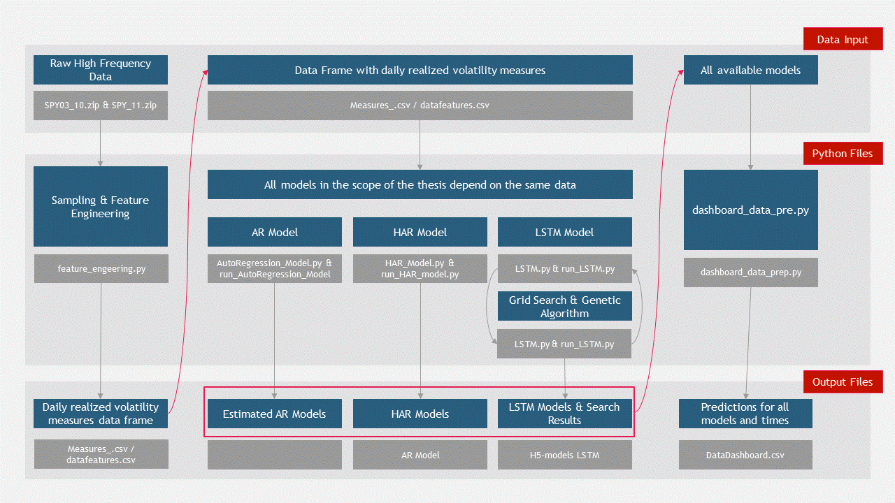

## ReadMe: LSTM Neural Networks and HAR Models for Realized Volatility - An Application to Financial Volatility Forecasting

The following document aims to provide an overview of the whole code base used throughout the thesis. It does not aim to explain theoretical background for the thesis, but rather provide an overview of how the code, the data and the results are structured. For theoretical background I kindly refer to the text version of the thesis: 

Generally speaking, this repository contains code for all the data loading, preprocessing, estimation, training, and prediction. For reporting the results an individual repository was set up containing a dashboard with all the relevant information. The dashboard repository can be found here: https://github.com/nickzumbuehl/dashboard_deployment and the dashboard runs under the url: http://nick-vola.herokuapp.com.

This document outlines the following points:
1. Setting up the Code Base
   - Environment
   - Configuration
2. Pipeline Overview
3. Pipeline Walk-Through
   - Feature Engineering
   - Heterogeneous Autoregressive Model
   - LSTM
     - Define & Run LSTM Model
     - Grid Search & Genetic Algorithm
   - Autoregressive Model
   - Dashboard
   

## 1. Setting up the Code Base

#### Environment
The ```requirements.txt``` contains information on all the relevant packages and versions used in the code base. In order to set up the environment, the please follow the subsequent process:
1. cd to the directory where your ```requirements.txt```is located
2. activate your virtual environment
3. run: ``` pip install -r requirements.txt``` in your shell. Alternatively, when working with conda, run: ```conda install --file requirements.txt```.

#### Configuration
The ```config.py``` file sets up the folder structure. When cloning the repository from GitHub, all the relevant folders are already in place. Nevertheless, the ```config.py``` defines the path architecture and makes sure it runs on each individual local machine.

## 2. Pipeline Overview
The pipeline of the overall project is illustrated in the following figure. It can be splited into input-, process- and output files. The blue-colored boxes describe the proces or the content which is relevant for the corresponding step in the pipeline. The grey-colored boxes are indicating the name of the corresponding file in the repository.

Naturally, the input files are the files that are later processed by the python process files. The input files consist of ```.csv``` and ```.h5``` files, where the input data is stored in .csv-format and the models are stored in .h5-files. 
The output files are often times the input files for another python file in the pipeline. Hence, an output file can be an input file later in the process.



## 3. Pipeline Walk-Through
### Feature-Engineering
The file [```feature_engineering.py```](masterthesis/feature_engineering.py) processes high-frequency data to compute the relevant features (realized volatility, positive- & negative realized semi-variance). As a input it takes high-frequency data in a ```.csv```-format retrieved from the WRDS data base. High-frequency data tend to be extremely large in storage (for the period considered in the application at hand, we face approximately 50GB of high-frequency data). Therefore, each year of high-frequency data was processed separately and later concatenated to obtain the complete time series of volatility measures. The ```zip```-files for the raw high-frequency data pulled from WRDS can be found here: https://drive.google.com/drive/folders/1VVNbAx8bbY2Km-NGu5cBaK8lHFdmjRD1?usp=sharing

The output generated by [```feature_engineering.py```](masterthesis/feature_engineering.py) is a ```.csv```-file containing the time series of the volatility measures, which is saved in the [data](masterthesis/data)-folder in the repository. There are two ```csv```-files dumped in the [data](masterthesis/data)-folder. The first one is the concatenated file ```RealizedMeasures03_10.csv``` with the realized volatility time series that contain the data used for training and valiadtion and ranges from 2003 to 2010. The second one (```DataFeatures.csv```)contains the realized volatility time series for the testing set.

### Heterogeneous Autoregressive Model
The ```class HARModelLogTransformed``` defined in [```HAR_Model.py```](masterthesis/HAR_Model.py) defines the HAR model in a generic way, such that it can be customized easily. Taking a look on how the class is defined, one can observe the level of customizability.
```
class HARModelLogTransformed:
    def __init__(
        self,
        df,
        future=1,
        lags=[4, 20,],
        feature="RV",
        semi_variance=False,
        jump_detect=True,
        log_transformation=False,
        period_train=list(
            [
                pd.to_datetime("20030910", format="%Y%m%d"),
                pd.to_datetime("20080208", format="%Y%m%d"),
            ]
        ),
        period_test=list(
            [
                pd.to_datetime("20080209", format="%Y%m%d"),
                pd.to_datetime("20101231", format="%Y%m%d"),
            ]
        ),
    ):

```
The input variable ```df``` is defined as the data frame that is used for training & validation. Then the variable ```future``` lets us define the dependent variable (e.g. 1-day or 20-day ahead forecast). Through the ```lags```variable one can specify the lags to be included in the model. The ```semi-variance``` indicator is used to either include or exclude the additional volatility measure semi-realized volatility. The ```jump_detect``` boolean lets the user define how to preprocess the data and thus whether the jump detection methodology should be applied. Similarly, the ```log_transformation``` indication allows to choose whether to log-transform the data before estimating the model. Finally, through the two period lists, the training & valiadtion periods can be defined.

Having defined a class instance with the specific inputs, the complete model can be run by the method ```run_complete_model()```. To keep this readme-document relatively well-arranged, the author decided not to explain each individual method in the class. However, please checkout the file [```HAR_Model.py```](masterthesis/HAR_Model.py) to investigate all available methods.

Naturally, the [```HAR_Model.py```](masterthesis/HAR_Model.py)-file does not execute any code. It is rather a framework to define the HAR model in a generic setting. The model is run in [```run_HAR_model.py```](masterthesis/run_HAR_model.py). This file runs each specification of interest of the HAR model and saves it in a dictionary which can later be accessed by other python files. The file [```run_HAR_model.py```](masterthesis/run_HAR_model.py) estimates the models for each forecasting period, for both semi-variance indications and both indications of log-transformation. 

The results of the estimation along with the accuracy measures are saved in the output folder [```HARModel```](masterthesis/output/HARModel). The models itself are not saved, and thus have to be re-estimated each time the code is run.

### LSTM
#### Define & Run LSTM Model
Similarly to the HAR model, the LSTM models are defined by a python script and then subsequently run by another one. The 
[```LSTM.py```](masterthesis/LSTM.py)-file contains two classes that define the LSTM model. The ```class TimeSeriesDataPreparationLSTM``` defines the preprocessing part, whereas the ```class TrainLSTM``` trains a LSTM model for a given set of hyperparamteres.

Taking a look on how the ```class TimeSeriesDataPreparationLSTM``` is defined, one can observe the level of customizability.
```
class TimeSeriesDataPreparationLSTM:
    def __init__(
        self,
        df: pd.DataFrame,
        future: int = 1,
        lag: int = 20,
        feature: str = "RV",
        semi_variance: bool = False,
        jump_detect: bool = True,
        log_transform: bool = True,
        min_max_scaler: bool = True,
        standard_scaler: bool = False,
        period_train=list(
            [
                pd.to_datetime("20030910", format="%Y%m%d"),
                pd.to_datetime("20091231", format="%Y%m%d"),
            ]
        ),
        period_test=list(
            [
                pd.to_datetime("20100101", format="%Y%m%d"),
                pd.to_datetime("20101231", format="%Y%m%d"),
            ]
        ),
    ):

```
The input variable ```df```, ```future```, ```lag```, ```semi_variance```, ```jump_detection``` & ```log_transform``` have already be discussed in the previous paragraph and thus are neglected here. The only new inputs in this class are the ```min_max_scaler``` and the ```standard_scaler```, which both aim to scale the data after having it log-transformed. Please not that only one of the two scalers can be set to True. 

The ```class TrainLSTM``` then takes the preprocessed data as input and trains an LSTM model. The class is defined as follows: 
```
class TrainLSTM:
    def __init__(
        self,
        training_set,
        testing_set,
        activation=tf.nn.elu,
        epochs=50,
        learning_rate=0.01,
        layer_one=40,
        layer_two=40,
        layer_three=0,
        layer_four=0,
        adam_optimizer: bool = True,
    ):
```

Having defined both the classes the [```run_LSTM.py```](masterthesis/run_LSTM.py)-files executes the model for a given set of hyperparameters and input specifications. The saved LSTM models are saved in the output folder [```NeuralNet```](masterthesis/output/NeuralNet)

#### Grid Search & Genetic Algorithm
Facing the probelm of hyperparamter tuning, a python moule for hyperparameter optimization was put in place. The [```GeneticAlgorithm.py```](masterthesis/GeneticAlgorithm.py)-files contains the code for a genetic algorithm with an integrated grid search method.

The ```class GeneticAlgorithm``` aims to optimize the hyperparameters number of layers, neurons per layer and learning rate. For that reason, a search space has to be fined when initating the class. This class initiation is defined as follows:
``` 
class GeneticAlgorithm:
    def __init__(
        self,
        training_set_ga,
        testing_set_ga,
        network_architecture=OrderedDict(
            [
                ("Layer1", [10, 21, 5]),
                ("Layer2", [2, 20, 5]),
                ("Layer3", [1, 21, 1]),
                ("Layer4", [0, 5, 1]),
            ]
        ),
        learning_rate=[0.001, 0.1, 0.005],
        initial_population_source_external=False,
        build_grid_scenarios=True,
    ):
```
The training & testing set are defined to valiadte the performance for a given set of hyperparameters. The ```network_architecture``` dictionary defines the search space for the layers one to four. The ```learning_rate``` defines the search space for the learning rate. The boolean ```initial_population_source_external``` allows to start with an external initial population. This can be beneficial when an initial population has been computed perviously and thus improves optimization time. Finally, ```build_grid_scenarios``` indicates whether the initial population of the genetic algorithm should be based on a grid search method, or rather a random allocation in the search space. 

Similarly to the previous approach, the [```GeneticAlgorithm.py```](masterthesis/GeneticAlgorithm.py) is run by [```run_GeneticAlgorithm.py```](masterthesis/run_GeneticAlgorithm.py). This file preprocesses the data and then executes the grid search & genetic algorithm according the given specification. The results of the process are then saved in the output folder [```GridSearch_GA```](masterthesis/output/GridSearch_GA).

### Autoregressive Model
The autoregressive model is defined in its most generic form in [```AutoRegression_Model.py```](masterthesis/AutoRegression_Model.py). The ```class AutoRegressionModel``` defines a generic AR model which can be customized according to the following specifications. 
```
class AutoRegressionModel:
    def __init__(
        self,
        df: pd.DataFrame,
        future: int = 1,
        ar_lag: int = 1,
        period_train=list(
            [
                pd.to_datetime("20030910", format="%Y%m%d"),
                pd.to_datetime("20091231", format="%Y%m%d"),
            ]
        ),
        period_test=list(
            [
                pd.to_datetime("20100101", format="%Y%m%d"),
                pd.to_datetime("20101231", format="%Y%m%d"),
            ]
        ),
    ):
```
The accuracy results of the autoregressive models are dumped in the output folder [```AutoRegression```](masterthesis/output/AutoRegression). The models itself are not saved and thus have to be re-estimated each time.


### Dashboard
The file [```dashboard_data_prep.py```](masterthesis/dashboard_data_prep.py) prepares the data for the results-dashboard which runs under the url: http://nick-vola.herokuapp.com

The ```class DashboardDataPrep``` takes the all data sets along with all the estimated models as input. From thereon, it predicts realized volatility for each model specification and each data set. The resulting data frame contains all relevant information to compute accuracy measures. The accuracy computations and visualizations of the resulting predictions is done by [```dashb.py```](https://github.com/nickzumbuehl/dashboard_deployment/blob/master/dashb.py)-file in the repository https://github.com/nickzumbuehl/dashboard_deployment.

The csv-file with all the predictions is saved in the output folder [```Predictions```](masterthesis/output/Predictions)


